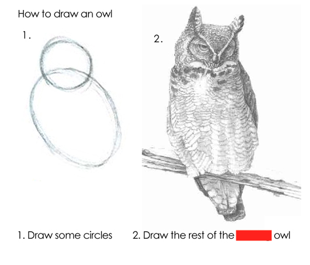

[//]: # (title page)
Rubik's cubes as a metaphor for app building

[//]: # (slide 1)
How do you solve a rubix cube?

[//]: # (slide 2)
Step 1 solve the first two layers

[//]: # (slide 3)
Step 2 orient the last layer

[//]: # (slide 4)
Step 3 permute the last layer

[//]: # (slide 5)

[//]: # (slide 6)
You will note, that’s ⅓ of the steps for the first two layers and ⅔ of the steps for the last layer

[//]: # (slide 7)
That’s because to change anything in a cube, you have to change something else

[//]: # (slide 8)
In the first two layers that no big deal as you have lots of room to mess stuff up

[//]: # (slide 9)
But when you get to the last layer, everything is constrained

[//]: # (slide 10)
Which is when it actually becomes relevant to app building

[//]: # (slide 11)
Apps are like rubik’s cubes, you can’t change anything without changing something else

[//]: # (slide 12)
This isn’t a defense of waterfall mind you

[//]: # (slide 13)
But a tool for thinking about the cost of changes

[//]: # (slide 14)
When you haven't built a feature, changes are free*

[//]: # (slide 15)
But once you have a built app, small change can mean a big change

[//]: # (slide 16)
"we'll get you data later"

[//]: # (slide 17)
ndows overly perscriptive data model

[//]: # (slide 18)
lets just add auth so that a single layer is hiden

[//]: # (slide 19)
migrating off carto

[//]: # (slide 20)
etc.

[//]: # (after)
fin
